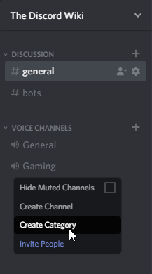

# Channel Categories
Channel categories are a feature of servers, allowing advanced channel organization. Channel categories were first announced on December 15th, 2016, as part of the 2016 End of Year Teaser. They were fully released on September 21st, 2017. Both text channels and voice channels can be in the same category.

## Channel Categories Usage
Channel categories can be made either with the right-click context menu, or the server settings drop down.  

 

Just as voice channel names, channel category names support spaces and custom characters, such as default emotes. Channel categories also support their own permissions, but will only apply to inside channels if they are synced with the category. 

The older "Text Channels" and "Voice Channels" are now made into categories on newer created servers, with older servers having no categories at all. The normal default channels (the two General channels that are created) still exist in the same categories, however.

